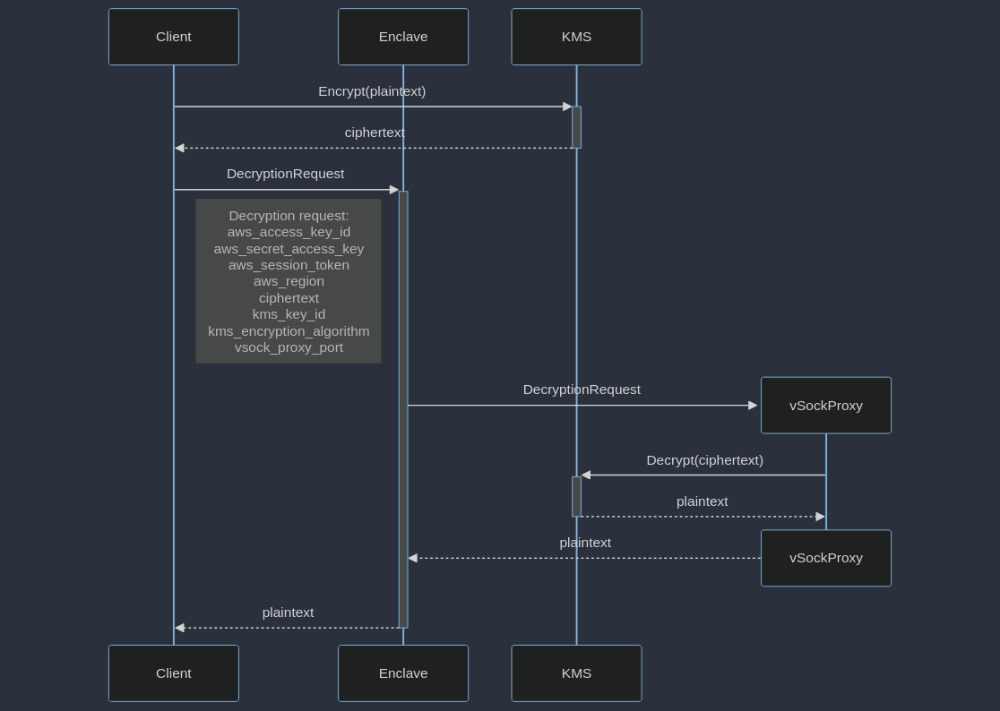

# Enclave KMS



## 1. Preparing Instance

|                      |                   |
| -------------------- | ----------------- |
| **Operating System** | Amazon Linux 2023 |
| **Instance Type**    | EC2 `m5.xlarge`   |
| **Storage**          | EBS `gp3` 20GB    |

## 2. Preparing KMS

1. Create new **Customer Managed Key**
2. In **Key Policy**, separate `kms:Decrypt` with condition `StringEqualsIgnoreCase.kms:RecipientAttestation:ImageSha384` with desired **Enclave Image PCR value** (see [Enclave Measurements](https://docs.aws.amazon.com/enclaves/latest/user/set-up-attestation.html#where)). For example:

```JSON
{
    "Sid": "Enable decrypt from enclave",
    "Effect": "Allow",
    "Principal": {
        "AWS": "arn:aws:iam::895513351287:user/administrator"
    },
    "Action": "kms:Decrypt",
    "Resource": "*",
    "Condition": {
        "StringEqualsIgnoreCase": {
        "kms:RecipientAttestation:ImageSha384": "000000000000000000000000000000000000000000000000000000000000000000000000000000000000000000000000"
        }
    }
}
```

## [3. Installing Nitro Enclave CLI](https://docs.aws.amazon.com/enclaves/latest/user/nitro-enclave-cli-install.html)

Install in the **remote instance**

## 4. Preparing Repository

Prepare in the **host device**

1. [Install Rust](https://www.google.com/url?q=https://www.rust-lang.org/tools/install&sa=D&source=docs&ust=1705554698432182&usg=AOvVaw0rW39ZE_czRLfyiqz947pW)
2. Install target

```bash
rustup target install x86_64-unknown-linux-musl
```

3. Clone [Repository](https://github.com/GDPWinnerPranata/enclave-kms-test)

```bash
git clone https://github.com/GDPWinnerPranata/enclave-kms-test
cd enclave-kms-test
```

4. Setup environment variable (see [`.env.example`](./.env.example))

```bash
# AWS
AWS_ACCESS_KEY_ID=AKIA0123456789ABCDEF
AWS_SECRET_ACCESS_KEY=AwSsEcReTkEy
AWS_REGION=us-east-2

# KMS
KEY_ID=012345678-89ab-cdef-0123-456789abcdef
ENCRYPTION_ALGORITHM=SYMMETRIC_DEFAULT

# Instance
INSTANCE="ec2-some-address.us-east-2.compute.amazonaws.com"
USERNAME=ec2-user

# KMS Proxy
PROXY_PORT=8000
```

5. Create `rs` directory in the remote instance

```bash
ssh username@instanceUrl ‘mkdir rs’
```

6. Build & copy everything over to remote instance

```bash
./tf-complete.sh
```

## 5. Testing

Prepare in the **remote instance**

0. Setup 3 remote terminals
1. Change all of their directories to `rs`

```bash
cd rs
```

### Terminal 1 `VSock Proxy`

1. Run VSock Proxy

```bash
./0-run-vsock-proxy.sh
```

### Terminal 2 `Enclave`

1. Build Docker Image

```bash
./1-build-image.sh
```

2. Build Enclave Image File (EIF)

```bash
./2-build-enclave.sh
```

3. **(Optional in debug mode)** Notice the PCR values of the EIF outputs. Update the KMS Key Policy values accordingly (see [Preparing KMS](#2-preparing-kms)).

4. Run Enclave (in debug mode)

```bash
./3-run-enclave.sh
```

### Terminal 3 (Client)

1. Run Client

```bash
./4-run-client.sh
```

The client will encrypt **“Hello, world!”** message using KMS and send it to the Enclave for decryption.
